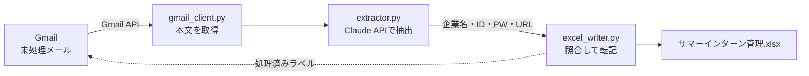

# 就活メール → Excel 自動転記システム

就活の「マイページ登録完了メール」から、**企業名・ログインID・パスワード・ログインURL** を
AIが自動で読み取り、管理用Excelに転記するツールです。
手作業でのコピペをなくし、書式がバラバラなメールでも安定して整理できます。


---

## 何ができる？

就活では何十社ものマイページに登録し、企業ごとに **ID・パスワード・URL** が発行されます。
これらは企業ごとにメールの書式がバラバラで、手作業での転記はミスも手間も多い作業です。

このツールは、Gmailの未処理メールを読み取り → AIで必要情報を抽出 → 既存のExcel管理表に
自動転記します。`run.bat` をダブルクリックするだけで完了します。

```
[2/4] メールを解析して Excel に転記中...
   1. [新規] 野村総合研究所 … ID=xxxxxxxx, URL=..., マイページ登録=済
   2. [更新] トヨタ … URL=...
   3. [対象外] 【セール】お得な情報
[4/4] 完了   新規追加: 2 件 / 既存更新: 1 件
```

---

## システム構成



| 処理 | 担当ファイル | 内容 |
|------|------------|------|
| メール取得 | `gmail_client.py` | Gmail APIで未処理メールを取得し、処理後にラベルを付与 |
| 情報抽出 | `extractor.py` | Claude APIで企業名・ID・PW・URLを構造化抽出 |
| Excel転記 | `excel_writer.py` | 企業名で既存行を照合し、空欄を補完／新規は追記 |
| 全体制御 | `main.py` | 上記をつなぎ、進捗と結果サマリを表示 |

---

## 工夫した点（技術的なポイント）

- **書式の違うメールに強い抽出**
  正規表現での決め打ちではなく、**Claude API の Structured Outputs（JSON Schema）** を使用。
  「ID：」「会員番号」「ログインID」など企業ごとに異なる表記でも、形を保証した
  JSONで安定して抽出できる設計にしました。

- **企業名の表記ゆれを吸収**
  既存の企業名リストをAIに渡し、**旧字体・略称・正式名の違いを同一企業と判定**します
  （例：`野村證券`＝`野村証券`、`トヨタ`＝`トヨタ自動車`）。
  さらに、正規化（`株式会社`等の除去）＋部分一致のフォールバックを実装し、
  別企業（`野村証券` と `野村総合研究所`）の誤マッチも防いでいます。

- **既存データを壊さない安全設計**
  原則として **空欄のセルだけを補完** し、既存の値は上書きしません（設定で変更可）。
  開発時は実機Excelの **コピーに対してテスト** してから本番反映する手順を徹底しました。

- **二重処理を防ぐべき等性**
  処理したメールには Gmail ラベルを付け、検索クエリで除外。
  何度実行しても同じメールを重複処理しません。

- **セキュリティ配慮**
  APIキー・OAuthトークン・個人パスを含むファイルは `.gitignore` で分離し、
  リポジトリには **テンプレート（`.env.example` / `config.example.json`）のみ** を公開。

- **設定の外部化**
  Excelの列マッピング、使用モデル、検索条件などは `config.json` で変更可能。
  コードを触らずに挙動を調整できます。

---

## 使用技術

| 分類 | 技術 |
|------|------|
| 言語 | Python 3.10+ |
| AI | Claude API（Anthropic / Structured Outputs） |
| メール | Gmail API（OAuth 2.0） |
| Excel | openpyxl |
| その他 | python-dotenv |

---

## セットアップ

詳しい手順は **[セットアップ手順.md](セットアップ手順.md)** を参照してください。概要：

1. `config.example.json` を `config.json` にコピーし、Excelのパスを設定
2. `.env.example` を `.env` にコピーし、Anthropic APIキーを記入
3. Google Cloud で Gmail API を有効化し、OAuthクライアントの `credentials.json` を配置
4. `run.bat` を実行

---

## ディレクトリ構成

```
.
├── main.py              # 全体の処理フロー
├── gmail_client.py      # Gmail取得・ラベル付け
├── extractor.py         # Claude APIで情報抽出
├── excel_writer.py      # Excelへ転記（照合ロジック）
├── config.example.json  # 設定のひな形
├── .env.example         # APIキーのひな形
├── requirements.txt     # 依存パッケージ
├── run.bat              # 起動用（ダブルクリック）
└── セットアップ手順.md   # 導入ガイド
```

---

## 公開・共有時の注意

次のファイルには秘密情報が含まれます。**絶対にコミット・共有しないでください**
（`.gitignore` で除外済み）：

- `.env`（APIキー）
- `credentials.json`（OAuthクライアントシークレット）
- `token.json`（アクセストークン）
- `config.json`（個人のローカルパス）

---

## ライセンス

[MIT License](LICENSE) で公開しています。
